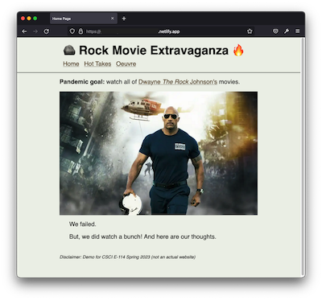
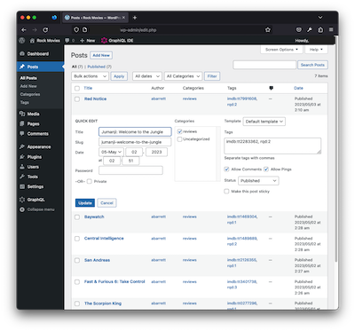

# Wordpress + Gatsby Example

This is an example using [WordPress](https://wordpress.com/) as a headless CMS with [Gatsby](https://www.gatsbyjs.com/) as the frontend for CSCI E-114, Spring 2023.

|Gatsby|Wordpress|
| ----------- | ----------- |
|  |  |


## Quickstart

To setup a local development environment for WordPress and Gatsby, you'll need [Docker](https://www.docker.com/) installed.

```
docker compose up  # Start Wordpress + DB
cd gatsby
npm install        # Install Gatsby dependencies
npm run develop    # Start Gatsby dev server
```

Once Wordpress and Gatsby are running locally, you can access each at the following URLs:

- **WordPress Admin**: http://localhost:8080/wp-admin
- **Gatsby Frontend**: http://locahost:8000/


## Data Sourcing

Wordpress is used as a headless CMS for the Gatsby site. In this example, Wordpress data is used to populate the _Hot Takes_ (reviews) page. In particular:

- Gatsby is configured to source **Posts** from Wordpress that are assigned to **Category: reviews**.
- **Posts** may have two optional tags:
  - `imdb:{imdb_id}`  where `imdb_id` is the IMDB ID like [tt0277296](https://www.imdb.com/title/tt0277296/)
  - `rqd:{rating}` where `rating` is 1-5
- Featured images associated with **Posts** are  sourced automatically and available to be used with `GatsbyImage`.

In addition to the Wordpress data source, Gatsby also pulls in static data describing the filmography of "The Rock" (see `gatsby/data`) and uses the [gatsby-plugin-remote-images](https://www.gatsbyjs.com/plugins/gatsby-plugin-remote-images/) to source the movie posters to generate a fast and performant _Oeuvre_ page.


## Netlify Deployment

To setup [Netlify](https://netlify.com/) deployment, you need to have a Netlify account and publicly accessible Wordpress site configured with the [WPGraphQL](https://www.wpgraphql.com/) and [WPGatsby](https://wordpress.org/plugins/wp-gatsby/) plugins.

On **Netlify**:

1. Create a new "site" from the git repository
2. Configure *Site Settings > Build & deploy > Build settings*:
    ```
    Base directory: gatsby
    Build command: npm run build
    Publish directory: gatsby/public
    ```
3. Configure *Site Settings > Environment Variables*
   - Set the `WPGRAPHQL_URL` environment variable
   - Note that you can get the endpoint from the WPGraphQL plugin settings (_GraphQL > Settings_).
4. Configure *Site Settings > Build & deploy > Build hooks*:
    - Add build hook for `WPGatsby` Wordpress plugin

On **Wordpress**:

1. Go to _Settings > GatsbyJS_
    - Set the `Builds Webhook URL` using the Netlify build hook previously generated.
2. Test the integration by creating or editing a Post.
    - If it worked, you should see Netlify automatically start a new build.

## Credits

- The list of movies was obtained from https://en.wikipedia.org/wiki/Dwayne_Johnson_filmography
- Movie data and content was obtained from [OMDB API](https://www.omdbapi.com/) and intended for educational use only ([CC BY-NC 4.0](https://creativecommons.org/licenses/by-nc/4.0/)).
